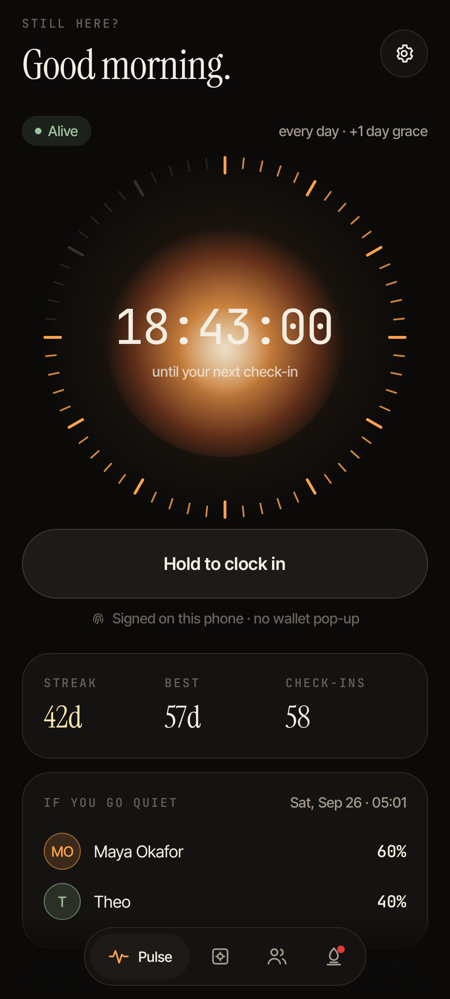
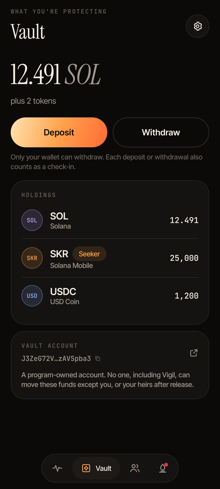
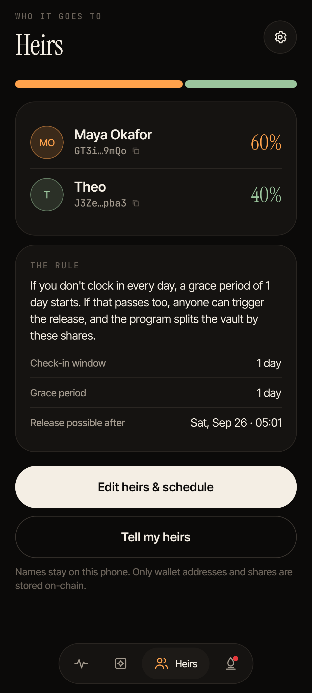
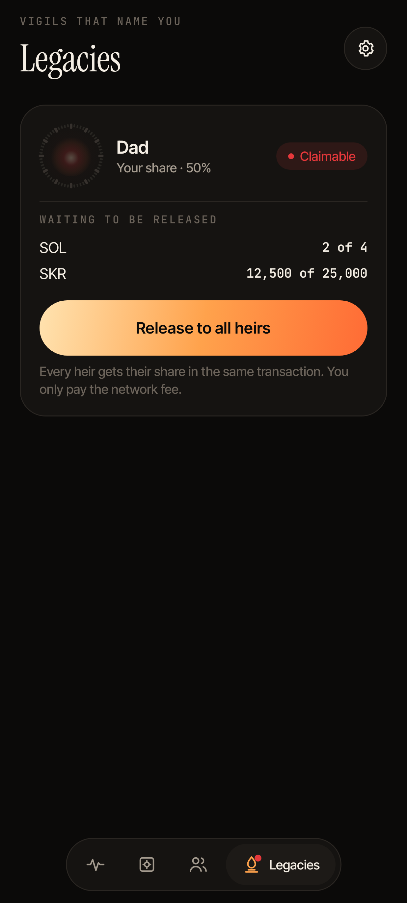
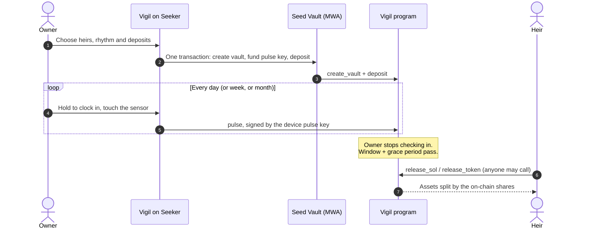

<p align="center">
  
</p> 

<p align="center">
  <a href="#build"></a>
  <a href="https://explorer.solana.com/address/VigddEZM9A4TuLmKFkY5qwVA5eCDDniEPJ4gmGQM512?cluster=devnet"></a>
  
  
  <a href="LICENSE"></a>
</p>

**Vigil** is a dead man's switch for your crypto, built for the Solana Seeker.

You clock in on a rhythm you choose (daily, weekly, monthly) with a single hold and a fingerprint. As long as you keep checking in, nothing happens and your funds stay entirely yours. If you go quiet for longer than your window plus a grace period, a Solana program releases your SOL, SKR and SPL tokens to the people you named.

No custodian. No lawyer. No seed phrase in an envelope.

**[vigil-seeker.vercel.app](https://vigil-seeker.vercel.app)** · [Download the APK](https://github.com/victorhez/vigil/releases/latest) · [Program on Solana Explorer](https://explorer.solana.com/address/VigddEZM9A4TuLmKFkY5qwVA5eCDDniEPJ4gmGQM512?cluster=devnet)

<p align="center">
  
  
  
  
</p>

---

## Why

Self-custody has no next of kin. When someone dies, is incapacitated, or simply loses their keys, their assets become unreachable for everyone. Chainalysis has estimated that around a fifth of all bitcoin is lost or stranded, and there is no reason to think Solana wallets fare better.

The usual answers are all bad trade-offs: hand a seed phrase to a relative (who can then take everything today), trust a custodian (who can freeze or lose it), or do nothing.

Vigil takes a different route. **Your phone becomes a heartbeat.** The funds stay under your control while you are around, and move to your heirs only when you have stopped proving that you are.

## How it works



1. **Light a Vigil.** Pick up to five heirs with percentage shares, a check-in window and a grace period. Your wallet signs one transaction that creates the vault, deposits what you want protected, and funds a small device key with 0.01 SOL for fees.
2. **Clock in.** Hold the button, touch the sensor. A key sealed in your phone's hardware keystore signs a `pulse` transaction. There's no wallet pop-up, and it takes about a second.
3. **Stay in control.** Deposit, withdraw, change heirs or close the vault at any time from your wallet. Every owner-signed action also counts as a check-in.
4. **If you go quiet.** Once `last_pulse + interval + grace` has passed, anyone can trigger the release: an heir, a friend, a bot. The program splits every lamport and token strictly by the shares stored on-chain. The caller cannot redirect anything.

## Built for the phone

Vigil only makes sense on a device you carry every day, so it is native Android from the ground up (Kotlin, Jetpack Compose) rather than a web port.

| | |
|---|---|
| **Hardware-backed pulse key** | An Ed25519 key generated on device, sealed with AES-GCM under an Android Keystore key that unlocks only after biometric or screen-lock authentication. It can check in and nothing else. |
| **Hold-to-clock-in ritual** | A deliberate press-and-hold with haptic ticks, then a "lub-dub" heartbeat haptic on success. The kind of small ritual that sticks as a habit. |
| **Home screen widget** | Glance widget with a live mini-dial, the next deadline and a one-tap **Clock in** button. |
| **Quick Settings tile** | Swipe down, tap, touch the sensor. The fastest check-in on the phone. |
| **App shortcut** | Long-press the icon → **Clock in**. |
| **Smart reminders** | WorkManager re-reads the vault from the chain and nudges you when a quarter of your window is left, when you've missed it, and if it expires. |
| **Mobile Wallet Adapter** | Owner actions go through MWA 2.x, so Seed Vault on Seeker (or any MWA wallet) signs them. |
| **QR scanning** | Scan an heir's address instead of pasting it. |
| **Share sheet** | "Tell my heirs" sends them a note explaining what to do and where the vault is. |

### Daily engagement, by design

A dead man's switch only works if you actually check in, so the check-in itself is the product:

- **Streaks** are counted on-chain (consecutive UTC days) and shown on the home screen, alongside your best streak and total check-ins.
- **The Pulse dial** is a clock face whose lit ticks are the time you have left. The flame at its centre beats while you're alive and dims as the deadline nears.
- **Legacies** shows every vault that names you as an heir, whether its owner is still checking in, and a one-tap release once they've gone quiet.

### SKR, first-class

SKR (`SKRbvo6Gf7GondiT3BbTfuRDPqLWei4j2Qy2NPGZhW3`) is recognised and featured across the app. It's pinned to the top of every asset list, tagged **Seeker**, and gets a dedicated **Protect your SKR** prompt whenever you hold SKR that isn't covered by your vault. Release works for SKR exactly as for any SPL or Token-2022 asset.

## Try it

1. Install the APK from the [latest release](https://github.com/victorhez/vigil/releases/latest) on an Android 11+ phone (Seeker, or any phone with a Mobile Wallet Adapter wallet such as Phantom or Solflare set to devnet).
2. Connect your wallet. In **Settings → Get 1 devnet SOL** if you need funds.
3. **Light your Vigil** with the **2 minutes** rhythm and **1 minute** grace (devnet-only options), a second wallet of yours as heir, and 0.1 SOL.
4. **Hold to clock in** a couple of times and watch the streak and the on-chain log update.
5. Stop checking in. Three minutes later, open **Legacies** from the heir wallet and tap **Release to all heirs**.

## Security model

| Actor | Can | Cannot |
|---|---|---|
| **Owner wallet** | Create, configure, deposit, withdraw, rotate the pulse key, close, check in, revive an expired vault that hasn't been released | Act after the vault has been released |
| **Pulse key (phone)** | Check in while the vault is alive | Move funds, change heirs, revive an expired vault |
| **Heir / anyone** | Trigger release once expired | Release early, choose recipients, change shares |

Design decisions worth calling out:

- **Stolen phone ≠ stolen funds.** The pulse key has no authority over assets. It is also refused once a vault has expired, so a phone found after its owner's death can't hold the vault hostage. Only the owner's wallet can revive it.
- **Every owner signature is proof of life.** `configure`, `deposit`, `withdraw`, `withdraw_token` and `rotate_pulse_key` all refresh `last_pulse`.
- **Release is permissionless but fixed.** Destinations are checked against the vault's heir list (`HeirMismatch`), including token account owner and mint. Rounding dust goes to the last heir, so nothing is stranded.
- **Rent-safe withdrawals.** The vault can never be drained below its rent-exempt minimum.
- **Sealed after release.** The first release sets `released_at`; from then on the owner can no longer withdraw or reconfigure, so a partially released estate can't be pulled back mid-distribution.
- **Local-only names.** Heir nicknames stay on the device. Only wallet addresses and shares are on-chain.
- **No cloud backup of keys.** `data_extraction_rules.xml` excludes the sealed pulse key from backups and device transfer.

Known limitations are listed in [docs/SECURITY.md](docs/SECURITY.md).

## Program

Deployed on devnet at [`VigddEZM9A4TuLmKFkY5qwVA5eCDDniEPJ4gmGQM512`](https://explorer.solana.com/address/VigddEZM9A4TuLmKFkY5qwVA5eCDDniEPJ4gmGQM512?cluster=devnet).

| Instruction | Signer | Effect |
|---|---|---|
| `create_vault(interval, grace, pulse_key, heirs)` | owner | Opens the vault PDA `["vault", owner]` and records the first check-in |
| `pulse()` | owner or pulse key | Proof of life; advances the daily streak |
| `configure(interval, grace, heirs)` | owner | Replaces the schedule and heir list |
| `rotate_pulse_key(pulse_key)` | owner | Binds check-ins to a new device |
| `deposit(amount)` | anyone | Adds SOL; counts as a check-in when the owner deposits |
| `withdraw(amount)` / `withdraw_token(amount)` | owner | Returns SOL / tokens to the owner |
| `close_vault()` | owner | Closes a live vault |
| `release_sol()` | anyone, after expiry | Splits spare SOL across heirs |
| `release_token()` | anyone, after expiry | Splits one token balance across heirs (SPL and Token-2022) |

Constraints: interval 60 s – 5 years, grace 0 – 1 year, 1–5 heirs, shares in basis points summing to exactly 10,000.

## Repository

```
program/                 Anchor program (Rust)
  programs/vigil/src/
    state.rs             Vault account, streak and split logic (+ unit tests)
    instructions/        create, pulse, owner-only, release
  tests/e2e.ts           Full lifecycle test against a live cluster
  scripts/deploy.ts      Deploy / upgrade via the upgradeable loader (web3.js only)
android/                 Native Android app (Kotlin, Jetpack Compose)
  app/src/main/java/app/vigil/
    solana/              Keys, PDAs, transaction encoding, RPC, Vigil instruction builders
    security/            Keystore-sealed pulse key, biometric presence
    wallet/              Mobile Wallet Adapter bridge
    data/                Repository, preferences, token registry
    ui/                  Design system, Pulse dial, screens
    widget/ system/      Glance widget, Quick Settings tile, reminders, haptics
  app/src/test/          web3.js compatibility tests, Roborazzi screenshots
site/                    Landing page (vigil-seeker.vercel.app), also the wallet identity
docs/                    Security notes, demo script, screenshots
```

The Android client has no Solana SDK dependency beyond Mobile Wallet Adapter. Transaction encoding, PDA derivation and account decoding are implemented in about 700 lines and verified byte-for-byte against `@solana/web3.js` in [`SolanaCompatTest`](android/app/src/test/java/app/vigil/solana/SolanaCompatTest.kt).

## Build

### Android

Requirements: JDK 17+, Android SDK 37.

```bash
cd android
./gradlew assembleRelease          # app/build/outputs/apk/release/app-release.apk
./gradlew testDebugUnitTest        # compatibility tests
./gradlew recordRoborazziDebug     # regenerate docs/screens
```

Release signing reads `android/keystore.properties` (`storeFile`, `storePassword`, `keyAlias`, `keyPassword`). Without it, release builds fall back to the debug key.

The app targets devnet. `VIGIL_PROGRAM_ID`, `RPC_URL` and `CLUSTER` are set in [`app/build.gradle.kts`](android/app/build.gradle.kts).

### Program

Requirements: Rust, Solana CLI 4.x (Agave) with platform-tools.

```bash
cd program
cargo build-sbf                    # target/deploy/vigil.so
cargo test --lib                   # state unit tests
npm install
npm run deploy                     # VIGIL_PAYER, VIGIL_PROGRAM_KEYPAIR
npm run test:e2e                   # VIGIL_FUNDER=<funded devnet keypair>
```

The end-to-end suite creates a vault with a 60-second window, checks in with a device key, verifies that strangers, premature releases and swapped heir accounts are rejected, lets the vault expire, releases SOL and an SPL token 60/40, and confirms the vault is sealed afterwards.

CI builds the program and the APK on every push ([`.github/workflows/ci.yml`](.github/workflows/ci.yml)).

## Roadmap

- **Guardians.** Optional co-signers who can veto a release during the grace period.
- **Sealed letters.** Messages encrypted to each heir and revealed on release.
- **.skr and .sol names** for heirs.
- **Keeper network.** Automatic release so heirs don't need to act.
- **Mainnet** after an external audit.

## License

[MIT](LICENSE)
